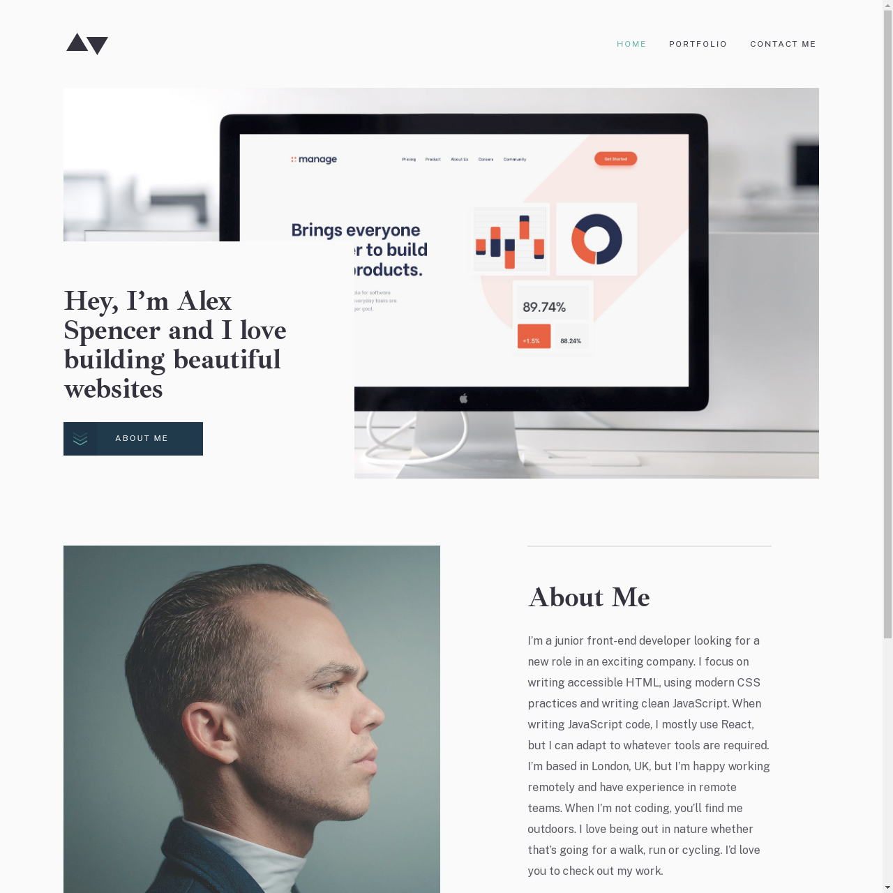

# Frontend Mentor - Minimalist portfolio website solution

This is a solution to the [Minimalist portfolio website challenge on Frontend Mentor](https://www.frontendmentor.io/challenges/minimalist-portfolio-website-LMy-ZRyiE). Frontend Mentor challenges help you improve your coding skills by building realistic projects. 

## Overview
This is the third premium challenge I have attempted on Frontend Mentor. 

### The challenge

Users should be able to:

- View the optimal layout for each page depending on their device's screen size
- See hover states for all interactive elements throughout the site
- Click the "About Me" call-to-action on the homepage and have the screen scroll down to the next section
- Receive an error message when the contact form is submitted if:
  - The `Name`, `Email Address` or `Message` fields are empty should show "This field is required"
  - The `Email Address` is not formatted correctly should show "Please use a valid email address"

### Screenshot

### Links

[Live Solution](https://bengera.github.io/minimalist-portfolio/)

### Built with

- Semantic HTML5 markup
- SASS/CSS
- Flexbox
- Vanilla JavaScript
- Mobile-first workflow

### What I learned / What I noted down

1. I have been mistakenly using buttons when I should have been using anchor elements. I realised this mistake when validating my HTML (The element button must not appear as a descendant of the a element). I did some reading on when each should be used. Buttons should be used to link to content on the current page. Anchor elements should be used for external pages.

2. I did find towards the end of the project that I was reusing CSS for some elements like the buttons.
Next time I should check which elements can be used as resuable components.

### Things I would do differently 

1. Checking which elements in the site could be used again and naming them apporpriately.

2. If this was a real website that people would be using I would probably
remove the ` ` tag as I'm aware that this can cause confusion for people using screen readers.

### Things I want to understand better

1. How to make custom messages to check that the form fields on the contact page have been filled in correctly.

